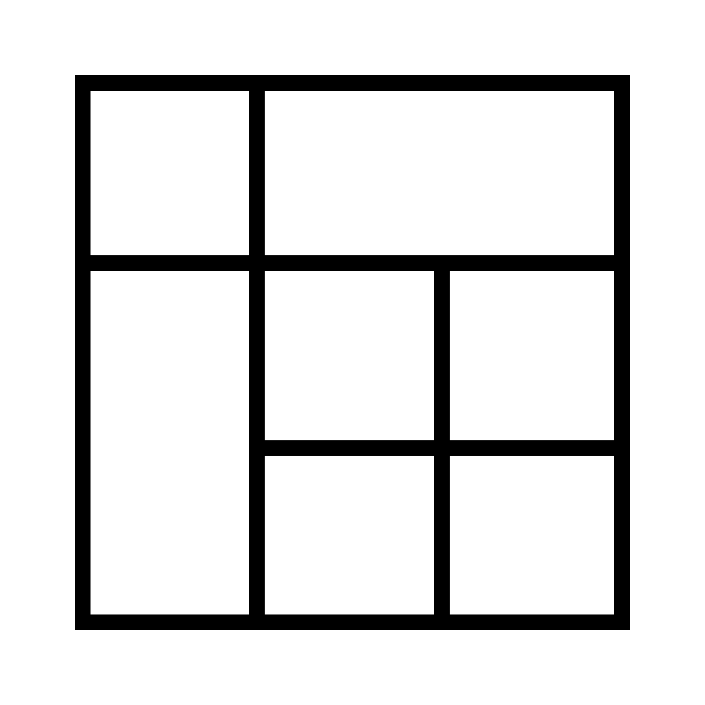

<div align="center">
  
  <h1>🧱 UI Qubes</h1>
  <p><strong>Copy-Paste. Ship. Contribute.</strong></p>

  <p>
    An open-source library of pre-built, production-ready React component blocks built to power modern web development. Skip the repetitive grind and focus on building your product's unique value.
  </p>

  <p>
    <a href="https://uiqubes.vercel.app/">Live Demo</a>
    ·
    <a href="./CONTRIBUTING.md">Contribute</a>
    ·
    <a href="https://discord.gg/543UyXXVGb">Discord</a>
  </p>

  <div>
    
    
    
    
    
  </div>
</div>

---

## 🚀 What’s Inside?

This is a modern **Turborepo** monorepo workspace containing:

| Package / App | Description |
| --- | --- |
| **`apps/web`** | A Next.js (App Router) documentation and explorer app to browse, search, and favorite components. |
| **`@uiqubes/ui`** | Reusable UI primitive components built with React, CVA, and standard accessibility in mind. |
| **`@uiqubes/utils`** | Reusable logic and utility functions (e.g., `cn` for Tailwind class merging). |
| **`@uiqubes/eslint-config`** \ **`@uiqubes/tsconfig`** | Shared ESLint & TypeScript configurations across the workspace. |

---

## 🛠️ Getting Started Locally

### Prerequisites
- Node.js >= 20
- [pnpm](https://pnpm.io/installation) >= 10

### 1. Clone & Install
```bash
git clone https://github.com/FL45h-09/uiqubes.git uiqubes-monorepo
cd uiqubes-monorepo
pnpm install
```

### 2. Start Developing
We use **Turborepo** to orchestrate tasks. You can run the entire local environment with one command:
```bash
pnpm dev
```
Navigate to `http://localhost:3000` to view the website.

---

## 🤝 Contributing

We 💖 contributions! Whether you want to improve an existing component, fix a bug, or add a brand new component to the library, your help is welcome.

Before getting started, please review our [Contributing Guide](CONTRIBUTING.md) to understand our workflow, branch naming conventions, and code standards.

### Features we are looking for (TODOs)
- **High Impact Sections:** Hero Sections, Navbars, Footers.
- **Form Primitives:** Inputs, Checkboxes, Switches, Comboboxes.
- **Complex Modules:** Data Tables, Modals/Dialogs, Carousels.

Please make sure you also read our [Code of Conduct](CODE_OF_CONDUCT.md).

---

## 💬 Community

- Join our developer chat on [Discord](https://discord.gg/543UyXXVGb)
- Use the **#uiqubes** hashtag when sharing your creations on social media!

---

## 📜 License

UI Qubes is freely available under the [MIT License](LICENSE). You can use it in your personal, open-source, or commercial projects without restriction.

---
<div align="center">
  <i>Maintained by @FL45h-09 and an amazing community of contributors.</i><br/>
  <i>Made with ☕, 🔥, and a hatred for rebuilding buttons over and over.</i>
</div>